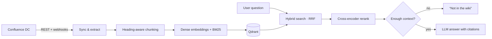

# Confluence RAG

**Ask your company wiki a question and get an answer with sources.**

This is a self-hosted retrieval-augmented Q&A system for **Confluence Data Center**. You ask in plain language. It finds the relevant pages, answers only from what they say, and cites every claim with a link to the source page. When the wiki doesn't contain the answer, it says so instead of guessing.

It runs entirely on your own infrastructure against any OpenAI-compatible endpoint, so no wiki content leaves your network.

```bash
curl -s localhost:8000/query -H 'content-type: application/json' \
  -d '{"question":"Wie erstelle ich einen S3 Bucket?"}'
# → { "answer": "... [1] ... [2]", "citations": [ {title, url}, ... ], "used_context": true }
```

---

## Results

Measured on a 20-question German evaluation set against a real Confluence instance:

| Retrieval setup | Hit-rate@5 | MRR |
|---|---|---|
| Hybrid search (dense + BM25, RRF fusion) | 0.950 | 0.703 |
| **+ cross-encoder reranking** | **1.000** | **0.818** |

Reranking raises MRR by about 16% relative and removes the last top-5 miss. Every question now has a correct source among the top five results, and it is usually ranked first.

This is a small eval set. It is enough to catch regressions and tune parameters, but it does not prove performance on every corpus.

---

## How it works



**Ingestion**
- Crawls allowlisted spaces through the Confluence REST API: PAT auth, pagination, CQL delta queries.
- Parses rendered page HTML into typed blocks, then chunks it along headings with a breadcrumb trail. Tables and code blocks are never split mid-way.
- Content hashing makes re-syncs cheap: only changed pages are re-embedded, and an unchanged wiki is a no-op.
- Webhooks propagate page creates, updates and deletes in near real time. This is verified end-to-end against a live instance.

**Retrieval**
- Dense vectors (`qwen3-embedding-0.6b`) and BM25 sparse vectors go into the same Qdrant collection and are fused with Reciprocal Rank Fusion.
- `bge-reranker-v2-m3` rescores the candidates, and a calibrated score threshold filters out weak matches.

**Generation**
- Answers are grounded strictly in the retrieved context, and inline `[n]` citations resolve to real page URLs.
- A two-stage "no answer" gate handles both empty retrieval and model-side refusal.
- Retrieved page content is treated as data, not instructions, to defend against prompt injection.

---

## Design decisions worth calling out

- **Permissions first.** Restricted pages are skipped entirely in v1. Leaking a page someone shouldn't see is worse than missing an answer. Per-user permission filtering is the natural next step.
- **Hybrid over pure vector search.** Internal wikis are full of product names, hostnames and abbreviations. BM25 catches exact terms that embeddings blur.
- **Thresholds are calibrated, not guessed.** The planned rerank cutoff of 0.3 would have rejected good answers on this corpus. In-corpus top hits scored around 0.145 and off-topic questions scored ≤ 0.008, so the cutoff is set to 0.05. `RETRIEVE_TOP_K` was swept from 6 to 40, and 10–12 performed best because more candidates only gave the reranker extra distractors.
- **The system adapts to the environment it runs in.** The target gateway didn't offer the planned models and rejected a parameter the OpenAI SDK injects, and the host had no Docker. The code works around all three. The details are listed below.

---

## Stack

Python · FastAPI · Qdrant (dense + sparse) · OpenAI-compatible LLM & embeddings · `bge-reranker-v2-m3` · SQLite for sync state · pytest

**API:** `POST /query` · `POST /webhook` (secret-verified) · `GET /health` (checks Qdrant, embeddings and the LLM)

---

## Quickstart

Requires Python 3.9+.

```bash
python3 -m venv .venv
./.venv/bin/python -m pip install -e ".[dev,index,api]"
cp .env.example .env            # Confluence URL + PAT, model endpoints, space allowlist
```

**Index your wiki**
```bash
./.venv/bin/python -m scripts.full_sync                          # full crawl + index
./.venv/bin/python -m scripts.full_sync --since "2026-09-01 00:00"  # delta
./.venv/bin/python -m scripts.full_sync --no-index               # extraction only
./.venv/bin/python -m scripts.reindex                            # drop + rebuild (after model/chunking changes)
```

**Serve**
```bash
./.venv/bin/uvicorn src.api.main:app --host 0.0.0.0 --port 8000
```

**Evaluate and test**
```bash
./.venv/bin/python -m eval.run_eval    # hit-rate@k / MRR over eval/dataset.jsonl
./.venv/bin/python -m pytest
```

All configuration comes from environment variables in `.env`, which is never committed. The Confluence PAT can be set as `CONFLUENCE_PAT` or `CONFLUENCE_TOKEN`.

**Qdrant mode:** set `QDRANT_PATH` for embedded local storage, which is single-threaded and all access is serialized. For real deployments, leave `QDRANT_PATH` empty and run Qdrant as a server via `docker-compose.yml`.

---

## Deviations from the original plan

| Planned | Actual | Why |
|---|---|---|
| BGE-M3 embeddings | `qwen3-embedding-0.6b` (1024-dim) | Not offered by the endpoint. It is called via the client's low-level `.post()` because the gateway rejects the `encoding_format` param the SDK injects (see `src/ingest/index.py`). |
| Qwen2.5 LLM | `qwen3.6-35b-a3b` | Not offered by the endpoint. This is a reasoning model, so thinking is disabled (`LLM_DISABLE_THINKING`). Otherwise it spends the whole token budget thinking and returns empty answers. |
| Rerank min 0.3 | 0.05 | Calibrated on the real score distribution (see above). |
| Qdrant in Docker | Embedded mode for dev | There is no Docker on the dev host. Compose is still provided for deployment. |
| Python 3.11+ | 3.9-compatible | This is the only version available on the host. |

---

## Status

The full spec and milestones are in [`plan.md`](plan.md). All five milestones are complete:

- **M1:** extraction and sync foundation
- **M2:** chunking, embedding and indexing
- **M3:** hybrid retrieval, reranking and eval
- **M4:** cited generation and API
- **M5:** webhook sync loop and hardening

---

## About

Built by **Dominik**, a freelance engineer in Vienna working on LLM/RAG systems, Kafka platforms and infrastructure automation.
If you want something like this on your own Confluence, or a second opinion on your RAG setup, get in touch: [LinkedIn](#) · [Email](#)